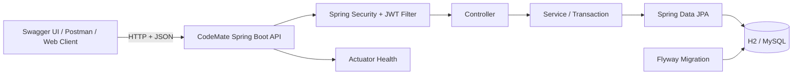
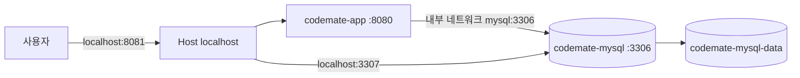
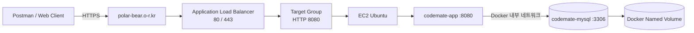
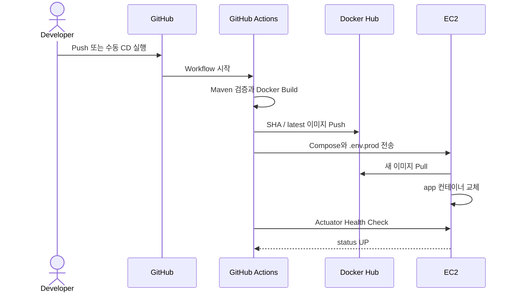
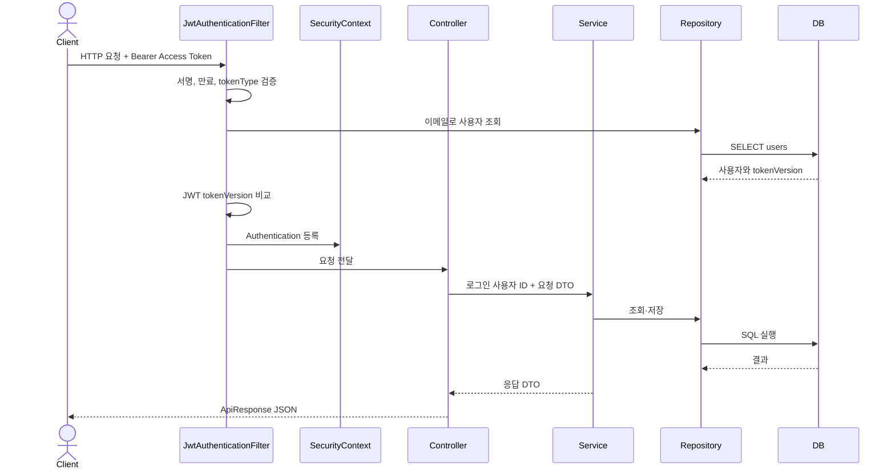
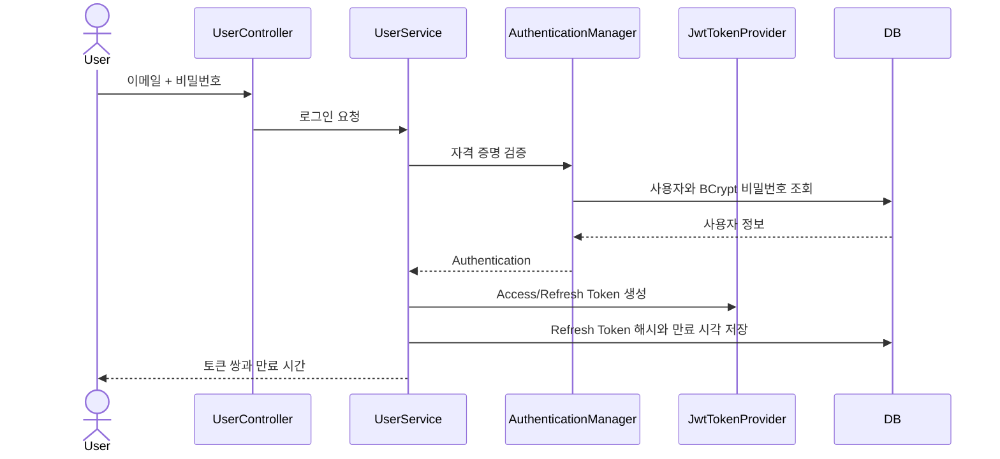
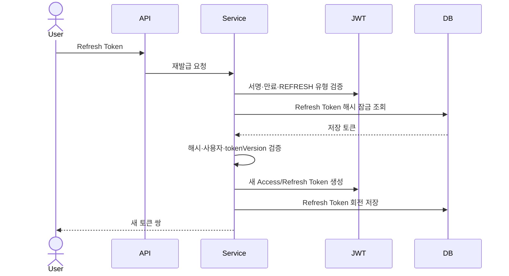
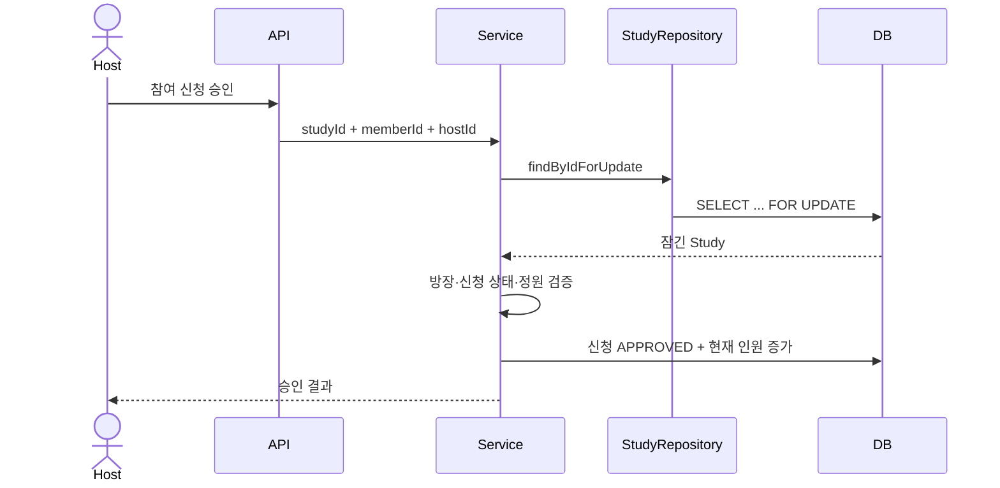

# CodeMate 시스템 아키텍처

CodeMate의 실행 구성, 애플리케이션 계층과 JWT 인증 요청 흐름을 정리한다.

## 시스템 구성도

## Docker 실행 구성

기본 포트는 `.env` 값에 따라 바꿀 수 있다. 애플리케이션 컨테이너는 MySQL health check가 성공한 뒤 시작한다.

## AWS 운영 배포 구성

1. HTTP `80` 요청은 ALB에서 HTTPS `443`으로 리다이렉트한다.
2. ACM 인증서를 적용한 ALB가 TLS를 종료한다.
3. ALB는 Target Group을 통해 EC2의 애플리케이션 `8080` 포트로 전달한다.
4. EC2 `8080` 인바운드는 ALB 보안 그룹만 허용한다.
5. MySQL `3306`은 외부에 공개하지 않고 Docker 내부에서만 사용한다.
6. ALB는 `/actuator/health`의 `200` 응답으로 대상 상태를 확인한다.

## 운영 배포 흐름

MySQL 컨테이너와 named volume은 애플리케이션 재배포 시 유지한다. 상세 설정은 [AWS 배포 문서](AWS_DEPLOYMENT.md)에서 확인한다.

## 애플리케이션 계층

| 계층 | 책임 |
|---|---|
| Controller | HTTP 요청 매핑, 입력 검증, 인증 사용자 전달, 응답 생성 |
| Service | 트랜잭션, 권한 검증, 비즈니스 상태 전이 |
| Repository | 엔티티 조회·저장, Specification, 비관적 락 |
| Entity | 핵심 상태와 상태 변경 규칙 보유 |
| Global | Security, 예외 처리, 공통 응답, 설정 |

패키지는 기능별 도메인을 먼저 나누고 각 도메인 내부에서 Controller, Service, Repository, Entity, DTO 계층을 구분한다.

## 일반 API 요청 흐름

토큰이 없거나 유효하지 않으면 SecurityContext를 비우고 인증이 필요한 경로에서 공통 `401` 응답을 반환한다.

## 로그인과 토큰 발급

## 토큰 재발급

이전 Refresh Token은 회전 직후 저장 해시와 달라져 다시 사용할 수 없다.

## 참여 승인 동시성 흐름

동일 스터디 승인 요청은 비관적 락으로 직렬화되어 정원을 초과하지 않는다.

## 프로필별 실행

| 프로필 | DB | 용도 |
|---|---|---|
| `h2` | 인메모리 H2 | 빠른 로컬 개발과 대부분의 테스트 |
| `mysql` | MySQL | 로컬·Docker 통합 실행 |
| `prod` | MySQL | 운영 설정, Swagger/H2 Console 비활성화 |

모든 프로필은 JPA `ddl-auto=validate`를 사용하고 스키마 변경은 Flyway가 담당한다.

## 보안 경계

1. JWT Secret과 DB 비밀번호는 환경변수로 전달한다.
2. 비밀번호는 BCrypt로 해시한다.
3. Refresh Token 원문은 DB에 저장하지 않고 SHA-256 해시를 저장한다.
4. 로그아웃과 비밀번호 변경은 사용자 `tokenVersion`을 증가시켜 기존 Access Token을 무효화한다.
5. 운영 프로필에서는 Swagger, OpenAPI JSON과 H2 Console을 노출하지 않는다.
6. 외부 HTTPS는 ALB에서 종료하고 EC2 애플리케이션 포트는 ALB 보안 그룹에만 허용한다.
7. 운영 MySQL은 호스트 포트를 공개하지 않고 Docker 내부 네트워크에서만 접근한다.
