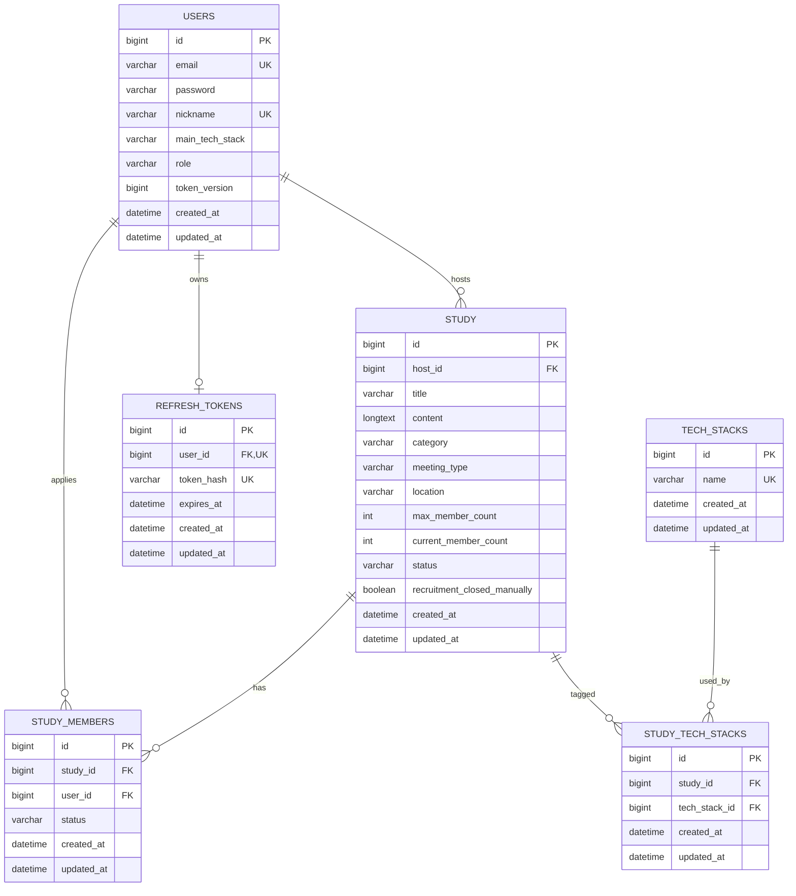

# CodeMate 데이터베이스 설계

CodeMate의 MySQL 기준 논리 모델과 테이블 정의를 정리한다. 실제 스키마 변경의 기준은 `src/main/resources/db/migration/mysql`의 Flyway SQL이다.

## ERD

## 테이블 정의

### users

회원과 인증 무효화 버전을 저장한다.

| 컬럼 | 타입 | 제약 | 설명 |
|---|---|---|---|
| `id` | BIGINT | PK, AUTO_INCREMENT | 회원 ID |
| `email` | VARCHAR(100) | NOT NULL, UNIQUE | 로그인 이메일 |
| `password` | VARCHAR(255) | NOT NULL | BCrypt 비밀번호 |
| `nickname` | VARCHAR(30) | NOT NULL, UNIQUE | 표시 이름 |
| `main_tech_stack` | VARCHAR(50) | NULL | 주요 기술 스택 |
| `role` | VARCHAR(20) | NOT NULL | `ROLE_USER`, `ROLE_ADMIN` |
| `token_version` | BIGINT | NOT NULL, DEFAULT 0 | 기존 JWT 일괄 무효화 버전 |
| `created_at` | DATETIME(6) | NOT NULL | 생성 시각 |
| `updated_at` | DATETIME(6) | NOT NULL | 수정 시각 |

### study

모집 글과 모집 인원·상태를 저장한다.

| 컬럼 | 타입 | 제약 | 설명 |
|---|---|---|---|
| `id` | BIGINT | PK, AUTO_INCREMENT | 모집 글 ID |
| `host_id` | BIGINT | FK, NOT NULL | 방장 회원 ID |
| `title` | VARCHAR(100) | NOT NULL | 제목 |
| `content` | LONGTEXT | NOT NULL | 내용 |
| `category` | VARCHAR(20) | NOT NULL | `STUDY`, `MOGAKKO` |
| `meeting_type` | VARCHAR(20) | NOT NULL | `ONLINE`, `OFFLINE` |
| `location` | VARCHAR(100) | NULL | 오프라인 지역 |
| `max_member_count` | INTEGER | NOT NULL | 최대 인원 |
| `current_member_count` | INTEGER | NOT NULL | 방장을 포함한 현재 인원 |
| `status` | VARCHAR(20) | NOT NULL | 모집·진행 상태 |
| `recruitment_closed_manually` | BOOLEAN | NOT NULL, DEFAULT FALSE | 방장 수동 마감 여부 |
| `created_at` | DATETIME(6) | NOT NULL | 생성 시각 |
| `updated_at` | DATETIME(6) | NOT NULL | 수정 시각 |

### study_members

사용자의 참여 신청과 승인 상태를 저장한다.

| 컬럼 | 타입 | 제약 | 설명 |
|---|---|---|---|
| `id` | BIGINT | PK, AUTO_INCREMENT | 참여 신청 ID |
| `study_id` | BIGINT | FK, NOT NULL | 모집 글 ID |
| `user_id` | BIGINT | FK, NOT NULL | 신청 회원 ID |
| `status` | VARCHAR(20) | NOT NULL | `PENDING`, `APPROVED`, `REJECTED` |
| `created_at` | DATETIME(6) | NOT NULL | 최초 신청 시각 |
| `updated_at` | DATETIME(6) | NOT NULL | 상태 변경 시각 |

`study_id`, `user_id` 복합 UNIQUE 제약으로 한 사용자의 동일 스터디 중복 신청을 방지한다. 거절 후 재신청은 기존 행의 상태를 `PENDING`으로 변경한다.

### tech_stacks

중복되지 않는 기술 스택 이름을 저장한다.

| 컬럼 | 타입 | 제약 | 설명 |
|---|---|---|---|
| `id` | BIGINT | PK, AUTO_INCREMENT | 기술 스택 ID |
| `name` | VARCHAR(50) | NOT NULL, UNIQUE | 기술 스택 이름 |
| `created_at` | DATETIME(6) | NOT NULL | 생성 시각 |
| `updated_at` | DATETIME(6) | NOT NULL | 수정 시각 |

### study_tech_stacks

모집 글과 기술 스택의 다대다 관계를 연결한다.

| 컬럼 | 타입 | 제약 | 설명 |
|---|---|---|---|
| `id` | BIGINT | PK, AUTO_INCREMENT | 연결 ID |
| `study_id` | BIGINT | FK, NOT NULL | 모집 글 ID |
| `tech_stack_id` | BIGINT | FK, NOT NULL | 기술 스택 ID |
| `created_at` | DATETIME(6) | NOT NULL | 생성 시각 |
| `updated_at` | DATETIME(6) | NOT NULL | 수정 시각 |

`study_id`, `tech_stack_id` 복합 UNIQUE 제약으로 같은 기술 스택의 중복 연결을 방지한다.

### refresh_tokens

사용자별 현재 유효한 Refresh Token 정보를 저장한다.

| 컬럼 | 타입 | 제약 | 설명 |
|---|---|---|---|
| `id` | BIGINT | PK, AUTO_INCREMENT | 토큰 저장 ID |
| `user_id` | BIGINT | FK, NOT NULL, UNIQUE | 회원 ID |
| `token_hash` | VARCHAR(64) | NOT NULL, UNIQUE | Refresh Token SHA-256 해시 |
| `expires_at` | DATETIME(6) | NOT NULL | 만료 시각 |
| `created_at` | DATETIME(6) | NOT NULL | 생성 시각 |
| `updated_at` | DATETIME(6) | NOT NULL | 회전 시각 |

사용자당 한 행만 유지하며 재발급 시 해시와 만료 시각을 교체한다.

## 관계와 삭제 정책

| 관계 | 설명 |
|---|---|
| User 1:N Study | 회원 한 명이 여러 모집 글의 방장이 될 수 있다. |
| User 1:N StudyMember | 회원 한 명이 여러 스터디에 신청할 수 있다. |
| Study 1:N StudyMember | 모집 글 하나가 여러 참여 신청을 가진다. |
| Study N:M TechStack | 연결 테이블을 통해 여러 기술 스택을 가진다. |
| User 1:0..1 RefreshToken | 사용자별 현재 Refresh Token 한 개를 유지한다. |

모집 글 삭제 시 Service에서 `study_members`, `study_tech_stacks`를 먼저 삭제한 뒤 `study`를 삭제한다. 데이터베이스 FK에는 `ON DELETE CASCADE`를 사용하지 않아 삭제 순서를 애플리케이션에서 명시적으로 관리한다.

## 인덱스와 제약

1. `users.email`, `users.nickname`, `tech_stacks.name`은 UNIQUE 인덱스를 가진다.
2. `study.host_id`, `study_members.user_id`, `study_tech_stacks.tech_stack_id`에 조회용 인덱스를 둔다.
3. 참여 신청과 기술 스택 연결은 복합 UNIQUE 제약으로 중복을 방지한다.
4. 참여 승인 시 `study` 행을 비관적 쓰기 잠금으로 조회한다.

## Flyway 이력

| 버전 | 파일 | 변경 |
|---|---|---|
| V1 | `V1__create_initial_schema.sql` | 핵심 5개 테이블과 인덱스 생성 |
| V2 | `V2__add_refresh_token.sql` | `token_version`, `refresh_tokens` 추가 |
| V3 | `V3__track_manual_recruitment_close.sql` | 수동 모집 마감 여부 추가 |

H2와 MySQL은 각 DB 문법에 맞는 별도 migration 디렉터리를 사용하며, JPA는 시작 시 Entity와 스키마 일치 여부를 검증한다.
