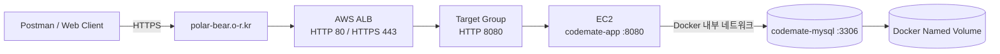
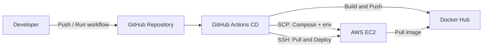

# CodeMate AWS 배포

CodeMate를 Docker Hub, GitHub Actions CD, AWS EC2, Application Load Balancer(ALB), ACM과 도메인으로 배포한 구성과 검증 결과를 정리한다.

## 최종 배포 결과

| 항목 | 결과 |
|---|---|
| 운영 도메인 | `https://polar-bear.o-r.kr` |
| Health Check | `https://polar-bear.o-r.kr/actuator/health` |
| 애플리케이션 | EC2의 `codemate-app` Docker 컨테이너 |
| 데이터베이스 | EC2의 `codemate-mysql` MySQL 8.4 컨테이너 |
| 이미지 저장소 | Docker Hub `dorigum/codemate` |
| 배포 자동화 | GitHub Actions `Build, Push and Deploy` |
| HTTPS | ACM 인증서와 ALB HTTPS Listener 적용 |
| 최종 상태 | ALB Target `Healthy`, Actuator `UP` |

운영 프로필에서는 Swagger UI와 OpenAPI JSON을 노출하지 않는다. 운영 API는 Postman으로 직접 요청해 검증한다.

## 배포 아키텍처





## 사용한 AWS 구성

### 1. EC2

1. Ubuntu 기반 인스턴스를 사용한다.
2. Docker와 Docker Compose Plugin을 설치한다.
3. 운영 배포 디렉터리는 `~/codemate`를 사용한다.
4. `codemate-app`과 `codemate-mysql` 컨테이너를 실행한다.
5. MySQL 데이터는 Docker named volume에 저장한다.

Docker 명령을 `sudo` 없이 사용하기 위해 다음 설정 후 SSH 세션을 다시 연결한다.

```bash
sudo usermod -aG docker ubuntu
```

### 2. Application Load Balancer

1. 인터넷 경계 ALB를 사용한다.
2. HTTP `80` Listener는 HTTPS `443`으로 리다이렉트한다.
3. HTTPS `443` Listener는 ACM 인증서를 사용한다.
4. Listener의 Forward 대상은 CodeMate Target Group이다.

### 3. Target Group

| 설정 | 값 |
|---|---|
| 대상 유형 | Instance |
| 프로토콜 | HTTP |
| 포트 | `8080` |
| Health Check 경로 | `/actuator/health` |
| 성공 코드 | `200` |

EC2 인스턴스를 Target Group의 `8080` 포트로 등록한다. Listener와 연결되지 않은 Target Group은 대상 상태가 `Unused`로 표시된다.

### 4. ACM과 도메인

1. ACM에서 `polar-bear.o-r.kr` 인증서를 발급하고 DNS 검증한다.
2. ALB HTTPS Listener에 인증서를 연결한다.
3. 도메인의 CNAME을 ALB DNS 이름으로 연결한다.
4. DNS 전파 후 HTTPS Health Check와 API 요청을 확인한다.

## 보안 그룹

### ALB 보안 그룹

| 포트 | 소스 | 용도 |
|---|---|---|
| `80` | `0.0.0.0/0` | HTTPS 리다이렉트 |
| `443` | `0.0.0.0/0` | 외부 HTTPS 요청 |

### EC2 보안 그룹

| 포트 | 소스 | 용도 |
|---|---|---|
| `8080` | ALB 보안 그룹 | ALB에서 애플리케이션으로 전달 |
| `22` | 관리자 IP 또는 배포 Runner 접근 범위 | SSH와 CD |

MySQL `3306`은 인터넷에 공개하지 않는다. 애플리케이션이 Docker 내부 네트워크의 `mysql:3306`으로 접근한다.

GitHub Hosted Runner로 SSH 배포할 때 Runner IP가 고정되지 않아 실습 중 `22` 포트를 전체 IPv4에 임시 허용했다. 실제 운영에서는 고정 Runner, VPN, AWS Systems Manager Session Manager 또는 배포 전용 네트워크를 사용하고 전체 공개 규칙을 제거해야 한다.

## 운영 파일

### compose.prod.yaml

1. Docker Hub의 `DOCKER_IMAGE:IMAGE_TAG` 이미지를 사용한다.
2. `codemate-app`은 `prod` 프로필로 실행한다.
3. MySQL은 호스트 포트를 공개하지 않는다.
4. MySQL named volume을 유지한다.
5. 애플리케이션은 MySQL Health Check 성공 후 시작한다.

### .env.prod

EC2의 `~/codemate/.env.prod`에 운영값을 저장한다. 이 파일은 Git에서 추적하지 않는다.

```dotenv
DOCKER_IMAGE=dorigum/codemate
IMAGE_TAG=latest
APP_PORT=8080

CODEMATE_DB_NAME=codemate
CODEMATE_DB_USERNAME=codemate
CODEMATE_DB_PASSWORD=운영_DB_비밀번호
MYSQL_ROOT_PASSWORD=MySQL_ROOT_비밀번호
CODEMATE_DB_USE_SSL=false

CODEMATE_JWT_SECRET=Base64_JWT_SECRET
```

실제 값은 문서나 저장소에 기록하지 않는다. 예시는 변수의 용도만 보여준다.

## GitHub Actions CD

### 필요한 GitHub Secrets

| Secret | 용도 |
|---|---|
| `DOCKERHUB_USERNAME` | Docker Hub 로그인 ID |
| `DOCKERHUB_TOKEN` | Docker Hub Access Token |
| `EC2_HOST` | EC2 Public IP 또는 DNS |
| `EC2_USERNAME` | SSH 사용자명 |
| `EC2_SSH_KEY` | EC2 Private Key 본문 |
| `CODEMATE_DB_PASSWORD` | CodeMate DB 계정 비밀번호 |
| `MYSQL_ROOT_PASSWORD` | MySQL root 비밀번호 |
| `CODEMATE_JWT_SECRET` | 운영 JWT 서명 키 |

### 배포 흐름

1. GitHub Actions에서 `Build, Push and Deploy`를 수동 실행한다.
2. Maven 검증과 Docker 이미지 빌드를 수행한다.
3. Docker Hub에 Git commit SHA 태그와 `latest` 태그를 Push한다.
4. GitHub Secrets로 `.env.prod`를 생성한다.
5. `compose.prod.yaml`과 `.env.prod`를 EC2 `~/codemate`로 전송한다.
6. EC2가 새 애플리케이션 이미지를 Pull한다.
7. MySQL 컨테이너와 volume은 유지하고 애플리케이션 컨테이너를 교체한다.
8. `/actuator/health`가 `UP`인지 확인한다.

## 수동 배포와 점검 명령

다음 명령은 EC2 SSH 터미널에서 `~/codemate`로 이동한 뒤 실행한다.

```bash
cd ~/codemate
docker compose --env-file .env.prod -f compose.prod.yaml config --quiet
docker compose --env-file .env.prod -f compose.prod.yaml pull
docker compose --env-file .env.prod -f compose.prod.yaml up -d
docker compose --env-file .env.prod -f compose.prod.yaml ps
```

로그 확인:

```bash
docker compose --env-file .env.prod -f compose.prod.yaml logs --tail 200 app
```

EC2 내부 Health Check:

```bash
curl -i http://localhost:8080/actuator/health
```

외부 HTTPS Health Check:

```bash
curl -i https://polar-bear.o-r.kr/actuator/health
```

정상 응답:

```json
{
  "groups": ["liveness", "readiness"],
  "status": "UP"
}
```

## 최종 검증

### 1. 컨테이너와 Flyway

1. `codemate-app`, `codemate-mysql` 컨테이너가 정상 실행되는 것을 확인했다.
2. 애플리케이션 로그에서 HikariCP 연결 성공을 확인했다.
3. MySQL에 Flyway V1부터 V3까지 순서대로 적용되는 것을 확인했다.
4. Hibernate Schema Validation이 성공하는 것을 확인했다.

### 2. ALB와 HTTPS

1. Target Group 대상 상태가 `Healthy`로 변경되는 것을 확인했다.
2. `http://polar-bear.o-r.kr` 요청이 HTTPS로 연결되는 것을 확인했다.
3. `https://polar-bear.o-r.kr/actuator/health`에서 `UP`을 확인했다.

### 3. 운영 API

Postman에서 다음 운영 URL을 사용했다.

```http
POST https://polar-bear.o-r.kr/api/users/signup
```

회원가입 요청이 성공했으며 로그인, 모집 글, 참여 관리 API도 같은 도메인을 기준으로 테스트할 수 있다. 인증 API에는 로그인 응답의 Access Token을 `Authorization: Bearer {accessToken}` Header로 전달한다.

### 4. 데이터 영속성

1. Postman으로 회원과 스터디 데이터를 생성했다.
2. 애플리케이션 컨테이너를 재시작했다.
3. Postman으로 기존 데이터를 다시 조회했다.
4. MySQL named volume에 데이터가 유지되는 것을 확인했다.

## 배포 트러블슈팅

### Docker Socket 권한 오류

- 증상: `/var/run/docker.sock` 연결 시 `permission denied`.
- 원인: Ubuntu 사용자가 `docker` 그룹에 포함되지 않았거나 변경된 그룹 권한이 현재 세션에 반영되지 않음.
- 해결: `sudo usermod -aG docker ubuntu` 실행 후 SSH 재접속.

### Docker Hub Pull 거부

- 증상: `pull access denied for docker-hub-username/codemate`.
- 원인: `.env.prod`의 `DOCKER_IMAGE`가 예시값으로 남아 있음.
- 해결: 실제 저장소인 `dorigum/codemate`로 수정하고 필요하면 `docker login` 실행.

### 기존 컨테이너 이름 충돌

- 증상: `codemate-mysql` 이름이 이미 사용 중이라는 오류.
- 원인: 저장소 디렉터리와 CD 배포 디렉터리에서 동일한 고정 컨테이너 이름으로 Compose를 각각 실행함.
- 해결: 배포 기준 디렉터리를 `~/codemate`로 통일하고 기존 컨테이너의 출처를 확인한 뒤 한 Compose 프로젝트로 관리.

### GitHub Actions SCP 연결 실패

- 증상: CD의 배포 파일 전송 단계에서 SSH 연결 시간 초과.
- 원인: EC2의 SSH `22` 포트가 개인 IP에만 열려 GitHub Hosted Runner가 접근하지 못함.
- 해결: 실습 중 Runner 접근을 허용해 배포 성공을 확인. 실제 운영에서는 고정 Runner 또는 SSM 기반 배포로 개선.

### ALB 502 Bad Gateway

- 증상: 도메인의 `/actuator/health`가 `502`.
- 원인: Target Group이 애플리케이션 포트 `8080`이 아닌 `80`으로 등록됨.
- 해결: HTTP `8080` Target Group을 사용하고 EC2 대상을 `8080`으로 등록.

### Target 상태 Unused

- 증상: 대상이 등록됐지만 `Unused`.
- 원인: Target Group이 ALB Listener의 Forward 대상으로 연결되지 않음.
- 해결: HTTP 또는 HTTPS Listener 규칙에 해당 Target Group 연결.

### Health Check 401

- 증상: Target 상태가 `Unhealthy`, 상세 코드가 `401`.
- 원인: 인증이 필요한 경로 또는 잘못된 기본 경로로 Health Check 요청.
- 해결: Health Check 경로를 인증 없이 허용된 `/actuator/health`, 성공 코드를 `200`으로 설정.

## 운영 후 남은 개선

1. SSH `22` 포트의 전체 공개를 제거하고 SSM 또는 고정 Self-hosted Runner를 적용한다.
2. CloudWatch 로그와 지표를 연결한다.
3. ALB Access Log를 저장한다.
4. EC2와 Docker volume의 백업 정책을 마련한다.
5. Terraform으로 VPC, 보안 그룹, ALB와 EC2 구성을 코드화한다.
6. 운영 API Smoke Test와 배포 실패 자동 Rollback을 추가한다.